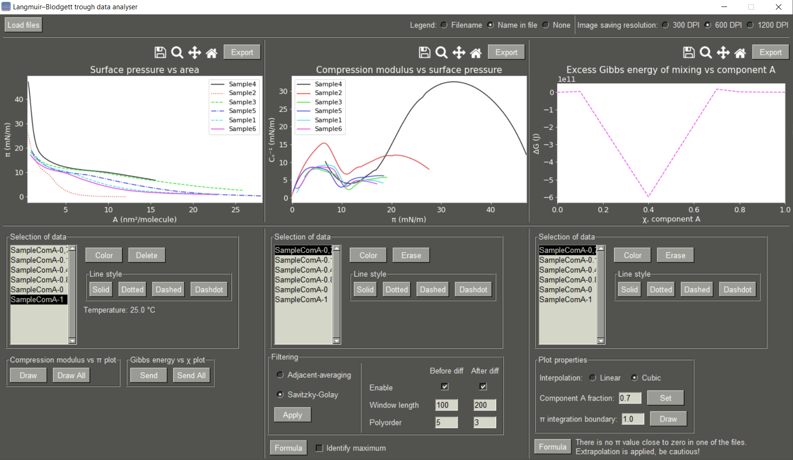

# Langmuir–Blodgett trough data analyser

The creation of this program was to simplify the analysis of the images obtained from [Langmuir–Blodgett trough](https://en.wikipedia.org/wiki/Langmuir%E2%80%93Blodgett_trough) laboratory apparatus KSV 2000
made by KSV Instruments Ltd. 
This program undergoes [CC BY 4.0](https://github.com/dnarkevi/lb-trough-data-analyser/blob/main/LICENSE.md) license, which means it is open source and can be used or modified in any way you want,
but you must reference the author by full name or [DOI](https://doi.org/10.5281/zenodo.799639).

## Features

- Grafic user interface (GUI)
- Plotting of molecular area vs surface pressure
- Calculation  of compression modulus
- Noise filtering
- Phase classification
- Excess Gibbs energy calculation
- Automatic concentration reading from a filename
- User-selected integration boundary
- Plotted line style and colour selection
- Image saving with multiple DPI options
- Data exporting of shown data in plots

## Usage

The program is designed to work on Windows. In the `win` folder executable files can be found. The Python scripts could be run on other OS, but this is not tested.
The source code is in the `build\scr` directory.

## Application screenshot

## Code

Python 3.10 was used to create this program. The mathematical aspect of this application is based on [this](https://pubs.acs.org/doi/10.1021/acs.jpcb.5b03604)
article supporting information. External packages are listed as follows:

- [PySimpleGUI](https://www.pysimplegui.org/)
- [Numpy](http://www.numpy.org/)
- [Scipy](https://www.scipy.org/)
- [Matplotlib](https://matplotlib.org/)

## Changelog

- v1.0 - Initial program version
- v1.1 - Added support for different regions
